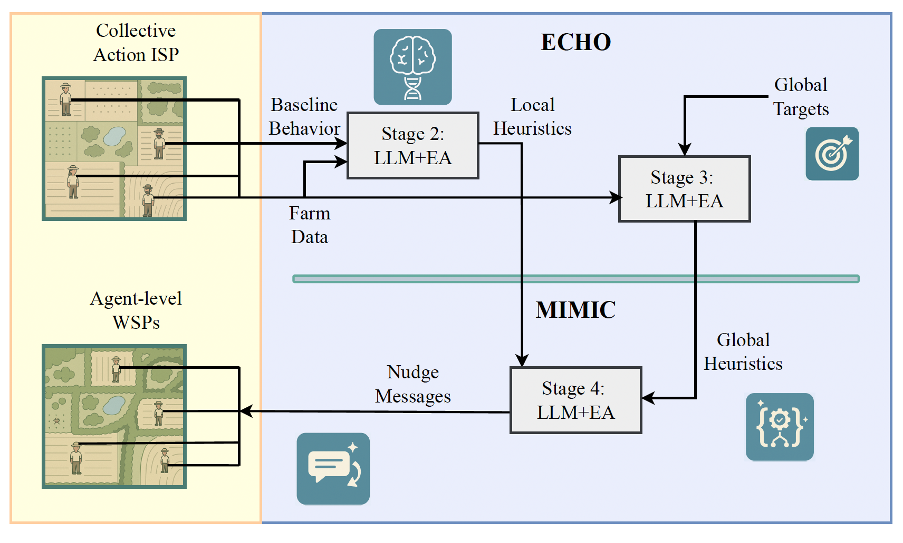

# ECHO-MIMIC

## Overview

ECHO-MIMIC is a computational framework that addresses collective action problems by converting global complexity into tractable, well-structured problems for individual agents. The framework discovers and supplies compact, executable heuristics and persuasive rationales that align individual incentives with collective goals.

Collective action problems are classic examples of Ill-Structured Problems (ISPs) where individual agents face unclear causal links between local actions and global outcomes, conflicting stakeholder objectives, and no clear algorithm to bridge micro-level choices with macro-level welfare. ECHO-MIMIC transforms these ISPs into Well-Structured Problems (WSPs) by coupling algorithmic rule discovery with tailored communication.

The framework is demonstrated on agricultural landscape management, where local farming decisions impact global ecological connectivity, but the approach applies broadly to other collective action domains including decentralized resource management and policy design.



## Key Features

- **Four-Stage Optimization Pipeline**: 
  - **Stage 1**: Establish baseline behavior (profit-maximizing actions)
  - **Stage 2**: Learn baseline heuristics (reproduce local profit-driven behavior)
  - **Stage 3**: Learn global heuristics (maximize landscape connectivity)
  - **Stage 4**: Nudge mechanisms (persuade adoption of global heuristics)
- **ECHO-MIMIC Framework**: Two-phase approach using LLM-driven evolutionary search
  - **ECHO** (Evolutionary Crafting of Heuristics from Outcomes): Evolves Python code snippets that encode behavioral policies (Stages 2-3)
  - **MIMIC** (Mechanism Inference & Messaging for Individual-to-Collective Alignment): Evolves natural language messages that motivate policy adoption (Stage 4)
- **LLM+EA Paradigm**: Large Language Models propose diverse, context-aware variants while population-level selection retains high-performing solutions
- **ISP → WSP Transformation**: Converts cognitive burden of collective action into simple agent-level instructions
- **Behavioral Modeling**: Tailored messaging for heterogeneous agent personalities and contexts
- **Scalable Policy Design**: Framework for adaptive mechanism design in complex systems

## Project Structure

```
.
├── echo_mimic/
│   ├── __init__.py              # Package entry point
│   ├── baselines/               # AutoGen + DSPy comparison methods
│   │   ├── autogen.py           # AutoGen-style planner/critic loop
│   │   └── dspy/                # DSPy baselines (farm/global/nudge)
│   ├── config.py                # Configuration and parameters
│   ├── common/                  # LLM helpers, code execution, and fix utilities
│   ├── prompts/                 # Prompt generation utilities
│   ├── tools.py                 # Plotting, metrics, and helper routines
│   ├── utils.py                 # Geometry helpers and plotting utilities
│   ├── rate_limiter.py          # API rate limiting utilities
│   └── dspy_rate_limiter.py     # DSPy LM wrapper with rate limiting
├── create_prompts.py            # Backwards-compatible prompt exports
├── *_evo_strat.py               # Evolutionary strategy entry points
├── run_experimental_suite.py    # Personality-Nudge experimental runner
└── requirements.txt             # Python dependencies
```

All shared runtime logic now lives under the structured `echo_mimic` package, while the
high-level experiment drivers remain as top-level scripts.

Farm-specific datasets (plots, ground-truth labels, and prompt seeds) are located under `data/farm/`,
while the energy EV datasets remain in `data/energy_ev/`.

## Core Components

### 1. ECHO-MIMIC Framework Implementation

#### ECHO (Stages 2-3): Evolutionary Crafting of Heuristics from Outcomes
- **`farm_evo_strat.py`**: **Stage 2** - Learn baseline heuristics (reproduce profit-driven behavior)
- **`graph_evo_strat.py`**: **Stage 3** - Learn global heuristics (maximize landscape connectivity)

#### MIMIC (Stage 4): Mechanism Inference & Messaging
- **`nudge_evo_strat.py`**: **Stage 4** - Behavioral nudging optimization and message evolution

### 2. DSPy Baselines (Comparison Methods)
- **`echo_mimic/baselines/dspy/farm.py`**: **Stage 2** DSPy baseline for learning farm-level heuristics
- **`echo_mimic/baselines/dspy/global_baseline.py`**: **Stage 3** DSPy baseline for global connectivity optimization
- **`echo_mimic/baselines/dspy/nudge.py`**: **Stage 4** DSPy baseline for nudging/behavioral messaging

## Installation

### Prerequisites
- Python 3.8 or higher
- Virtual environment (recommended)
- Google Gemini API key (for LLM functionality)

### Setup Instructions

1. **Clone the repository**:
   ```bash
   git clone <repository-url>
   cd ECHO-MIMIC
   ```

2. **Create and activate a Python virtual environment**:
   ```bash
   python3 -m venv venv
   source venv/bin/activate  # On Windows: venv\Scripts\activate
   ```

3. **Install dependencies**:
   ```bash
   pip install -r requirements.txt
   ```

4. **Configure API keys**:
   Create a `.env` file in the project root and add your API keys:
   ```bash
   GOOGLE_API_KEY=your_gemini_api_key_here
   ```
   
## Usage

### Unified Orchestrator

Run any combination of domain, mode, and method from a single entry point:

```bash
# Echo-MIMIC, farm domain, local heuristic optimization
python main.py --domain farm --mode local --method echo_mimic --agent-id alpha

# DSPy baseline for global farm heuristics
python main.py --domain farm --mode global --method dspy

# Energy domain with the lightweight AutoGen-style planner
python main.py --domain energy --mode nudge --method autogen --model gpt-4o-mini
```

The orchestrator also accepts `--population-size`, `--num-generations`,
`--inner-loop-size`, `--use-template`, `--no-hint`, `--halstead-metrics`, and
`--no-init` to fine-tune runs per scenario.

### Carbon-Aware EV Charging Scenario

A compact five-agent energy domain is bundled alongside the agricultural
experiments. The scenario captures carbon-aware EV charging with feeder
capacity limits and ships with the full four-stage pipeline assets:

- `data/energy_ev/scenario_1/scenario.json`: core state, objectives, and neighbor
  exemplars.
- Stage-specific prompts under `data/energy_ev/scenario_1/{local,global,nudge}`.
- Brute-force ground truths for imitation and collective stages, plus the global
  optimum allocation for nudging.
- Sample Python heuristics and a nudge message demonstrating end-to-end usage.

Regenerate artifacts or score new solutions with `energy_pipeline.py`:

```bash
# Refresh prompts + ground truth after editing scenario.json
python energy_pipeline.py generate

# Score a local imitation heuristic
python energy_pipeline.py evaluate-local data/energy_ev/scenario_1/local/heuristics_baseline.py

# Score a global coordination heuristic
python energy_pipeline.py evaluate-global data/energy_ev/scenario_1/global/heuristics_baseline.py

# Validate a nudging message JSON payload
python energy_pipeline.py evaluate-nudge data/energy_ev/scenario_1/nudge/sample_nudge.json
```

## Key Concepts

### ECHO-MIMIC Pipeline: From ISPs to WSPs
The framework transforms Ill-Structured Problems (ISPs) into Well-Structured Problems (WSPs) through a systematic decomposition:

**The Collective Action Challenge**: Individual agents face unclear causal links between local actions and global outcomes, conflicting objectives, and no clear algorithm to bridge micro-level choices with macro-level welfare.

**ECHO-MIMIC Solution**: 
1. **Stage 1**: Establish baseline behavior - compute profit-maximizing actions for each agent
2. **Stage 2** (ECHO): Learn executable Python heuristics that reproduce baseline behavior  
3. **Stage 3** (ECHO): Learn heuristics that maximize global objectives (landscape connectivity)
4. **Stage 4** (MIMIC): Evolve persuasive natural language messages that motivate adoption of global heuristics

**Result**: Complex collective action becomes a simple set of agent-level instructions, making previously ill-structured problems solvable in practice.

### Agricultural Demonstration Domain
The framework is demonstrated on agricultural landscape management as a canonical collective action problem:

**Agent Actions**:
- **Margin Interventions**: Convert plot boundaries for pollination/pest control services
- **Habitat Conversions**: Convert internal plot areas to create habitat patches
- **Spatial Placement**: Strategic positioning to maximize landscape connectivity

**Collective Action Challenge**: 
- **Local Incentives**: Farmers optimize Net Present Value (NPV) at the farm level
- **Global Objective**: Landscape-scale ecological connectivity (Integral Index of Connectivity)
- **Misalignment**: Individual profit-maximizing choices may harm overall ecosystem health

**ECHO-MIMIC Solution**:
- **ECHO**: Discovers compact Python heuristics that balance local profitability with global connectivity
- **MIMIC**: Evolves personalized messages that persuade farmers to adopt connectivity-improving practices

### Agent Heterogeneity (MIMIC Stage)
**Farmer Personalities**:
- **Resistant**: Highly skeptical of change, requires overwhelming evidence
- **Economic**: Pragmatic focus on profitability and financial outcomes  
- **Socially Influenced**: Motivated by peer practices and community validation

**Message Types**:
- **Behavioral**: Social proof, framing effects, commitment devices
- **Economic**: Subsidies, premium payments, transparent cost-benefit analysis

## Configuration

The `config.py` file contains all major configuration parameters:

- **Model Settings**: LLM model selection and API configuration
- **Rate Limiting**: API request throttling parameters
- **Economic Parameters**: Crop prices, costs, discount rates
- **Spatial Parameters**: Habitat types, intervention costs

## Data Format

The system expects farm data in GeoJSON format with:
- Agricultural plots (`type='ag_plot'`)
- Existing habitat plots (`type='hab_plots'`)
- Spatial geometry and connectivity information
- Economic parameters and crop types

## Output

The system generates:
- **Optimized Heuristics**: Python code for agricultural intervention strategies
- **Performance Metrics**: Fitness scores, connectivity indices, NPV calculations
